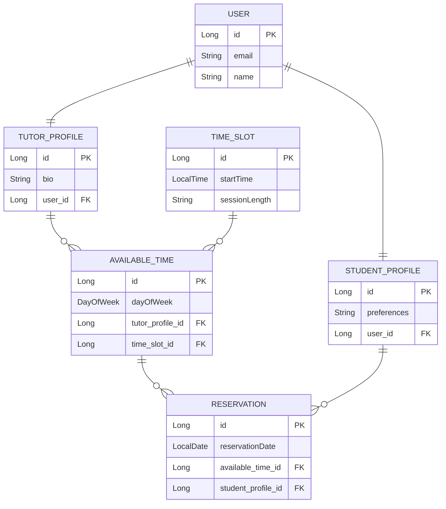
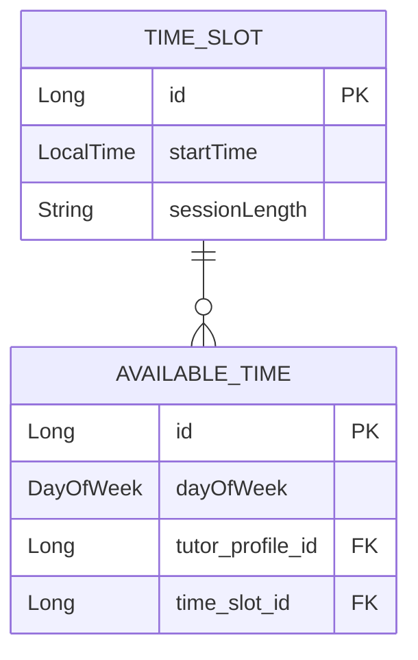
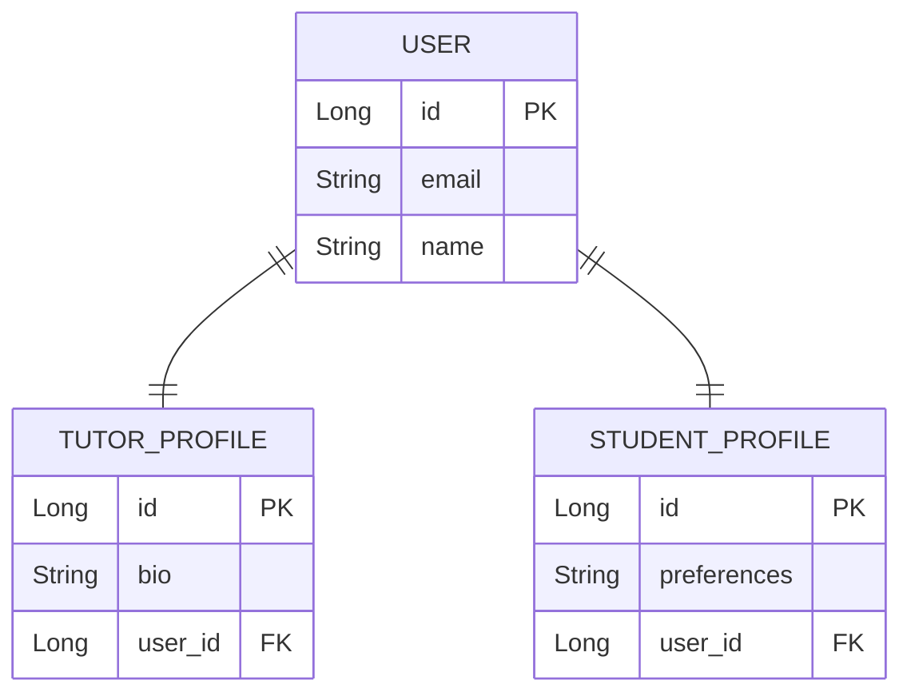
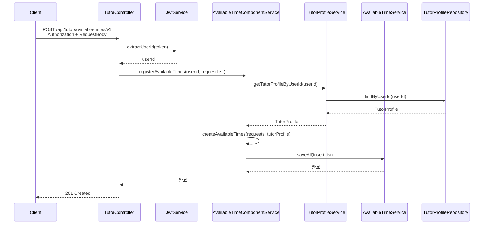
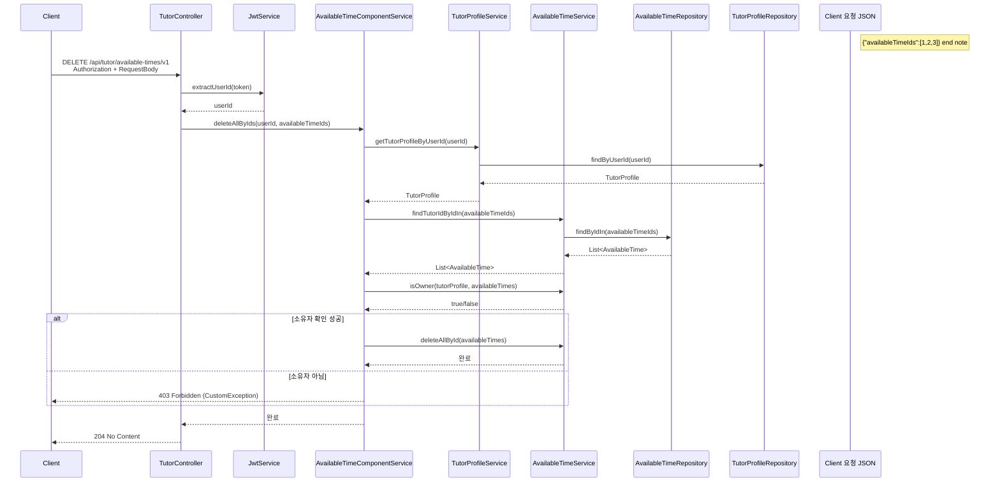
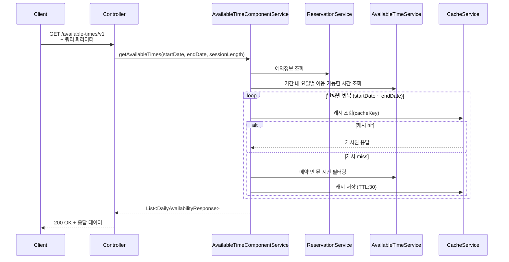
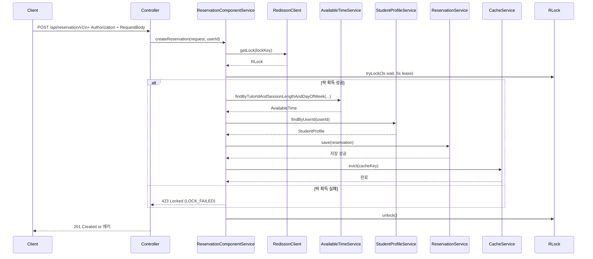
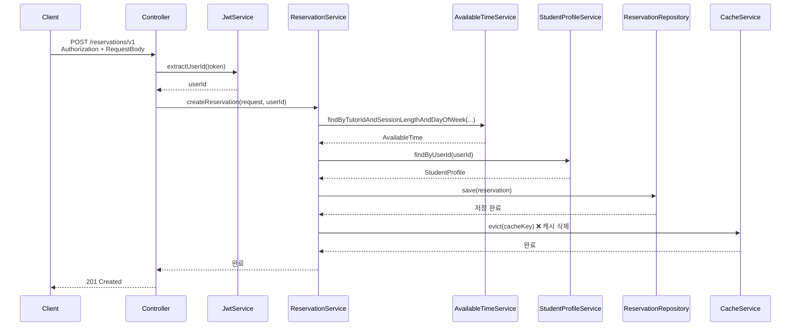
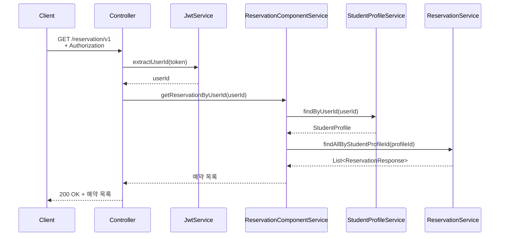

## ✅ 환경

Java 21, MySQL, Redis, Gradle<br>

## ✅ 실행 후 API 문서 URL

http://localhost:8080/swagger-ui/index.html

### Header - token: {id}

- `token 1` (Tutor), `token 2(`Student) 입니다.
- 구동 시 초기 데이터가 생성됩니다.

## ✅ 개요

- `CompoentService` : 여러 Service를 조합하여 하나의 유스케이스를 처리하는 역할을 수행 합니다.
- `DB I/O 최적화` :서비스 로직에서 반복 조회 대신, Bulk insert, JOIN, IN 등을 이용하여 DB 접근 횟수를 최소화했습니다.
- `Global Exception Handler` : 전역 예외 처리기를 통해 예외를 일관된 형식으로 핸들링하여, 예외 관리의 중복을 제거하고 했습니다.
- `Caching` : 현재 수업 가능한 시간대 응답을 Redis에 캐싱해 반복 계산을 줄이고 응답 속도를 향상시켰습니다.

## ✅ ERD 다이어그램



## ✅ 설계 배경: 예약 시간 관리

### 요구 사항 추가 : 튜터는 요일별로 수업 시간을 설정할 수 있다고 가정했습니다.

### `AvailableTime`은 요일과 시간 슬롯(자식)을 조합하여 튜터의 수업 가능 시간을 나타냅니다.



#### 시간 유연성과 데이터 정규화를 동시에 충족하기 위해 `TimeSlot`을 분리했습니다.

- `유연성 확보`: 현재는 30분 단위지만, 추후 15분·10분 등으로 변경 시에도 유연하게 대응하도록 TimeSlot을 별도 엔티티로 분리했습니다.
- `정규화 및 재사용`: 동일 시간 구간을 여러 튜터가 공유하므로 재사용성을 향상시켰습니다.

## ✅ 설계 배경: User 와 Profile 분리



#### `User`는 로그인·인증 등 공통 정보만 관리하고, 실제 역할별 행위는 `TutorProfile`, `StudentProfile`로 분리했습니다.

- 프로필이 존재해야 도메인 기능 접근 가능합니다.
- 역할별 도메인 클래스가 명확히 분리됩니다.
- 프로필별 필드가 자유롭게 확장 가능합니다.

## ✅ 수업 가능한 시간대 생성 & 삭제

#### 개요: 요일 마다 수업 가능한 시간대를 생성합니다.

```yaml
요청 JSON 예시:
  {
    "requestList": [
      { // 월요일 9:00 ~ 9:30, 10:00 ~ 10:30 수업 가능 시간대 생성
        "dayOfWeek": "MONDAY",
        "timmSlotCreateRequestList": [
          { "startTime": "09:00", "sessionLength": 30 },
          { "startTime": "10:00", "sessionLength": 30 }
        ]
      },
      { //수요일 14:00 ~ 15:00 수업 가능 시간대 생성
        "dayOfWeek": "WEDNESDAY",
        "timmSlotCreateRequestList": [
          { "startTime": "14:00", "sessionLength": 60 }
        ]
      }
    ]
  }
```

### 📍 jdbcTemplate을 이용하여 한번의 쿼리로 저장/삭제하였습니다.

```java
private final JdbcTemplate jdbcTemplate;

@Transactional
public void saveAll(List<AvailableTime> availableTimeList) {
	String sql = """
		INSERT INTO available_time (tutor_profile_id, time_slot_id, day_of_week, created_date, modified_date)
		VALUES (?, ?, ?, ?, ?)
		""";

	LocalDateTime now = LocalDateTime.now();

	jdbcTemplate.batchUpdate(sql, availableTimeList, availableTimeList.size(),
		(PreparedStatement ps, AvailableTime availableTime) -> {
			ps.setLong(1, availableTime.getTutorProfile().getId());
			ps.setLong(2, availableTime.getTimeSlot().getId());
			ps.setString(3, availableTime.getDayOfWeek().name());
			ps.setTimestamp(4, Timestamp.valueOf(now));
			ps.setTimestamp(5, Timestamp.valueOf(now));
		});

	{...}
}

```

### 📍생성 시퀀스 다이어그램



### 📍생성 시퀀스 다이어그램



## ✅ 기간 & 수업 길이로 현재 수업 가능한 시간대를 조회

#### 개요: 기간이 길어질 수록 리소스 사용량이 많아지기 때문에 캐싱을 적용했습니다.

### 📍시퀀스 다이어그램



## ✅ 시간대 & 수업길이로 수업 가능한 튜터 조회

`기간 & 수업 길이로 현재 수업 가능한 시간대를 조회` 한 뒤 이어서 해당 API로 튜터를 조회할 경우, 캐싱으로 인해 반영이 늦어 <br>
`수업 가능한 튜터`가 조회되지 않는 문제가 발생할 수 있습니다. 이를 해결하기 위해 아래와 같은 흐름을 가정하였습니다.

- 사용자가 수업 가능한 튜터를 조회했지만 아무 튜터도 없는 경우

```
선택한 시간은 누군가 방금 예약했어요!
다른 시간을 선택해 주세요.
[다른 시간 보기]   [달력으로 돌아가기]
```

예약시 관련된 캐싱 데이터를 제거하기 때문에 돌아가서 다시 조회하게 되면 최신데이터를 전달받을 수 있습니다.

### 📍시퀀스 다이어그램



### 또한 에약 과정에서 동시성 문제를 해결하기 위해 분산 락을 사용했습니다. DB의 부하를 분산하고 캐싱을 위해 Redis를 사용하고 있다는 점에서 적용하게 되었습니다.

## 레디스 장애 대응

#### 외부 시스템인 레디스에 장애가 발생한다면 분산락의 경우 어느 요청도 락을 획득하지 못하게 됩니다. 이를 해결하기 위해 장애 발생시 Mysql의 락으로 전환하는 방식을 고민하였습니다. 하지만 이러한 방식은 또다른 장애를 불러올 수 있다고 생각하여 적용하지 않았습니다. Redis의 장애가 문제라면 Redis의 고가용성을 고안하는 것이 더 좋은 방법이라고 생각했습니다.

## ✅ 시간대 & 수업길이로 튜터로 새로운 수업 신청

### 📍시퀀스 다이어그램



## ✅ 신청한 수업 조회

### 📍시퀀스 다이어그램


